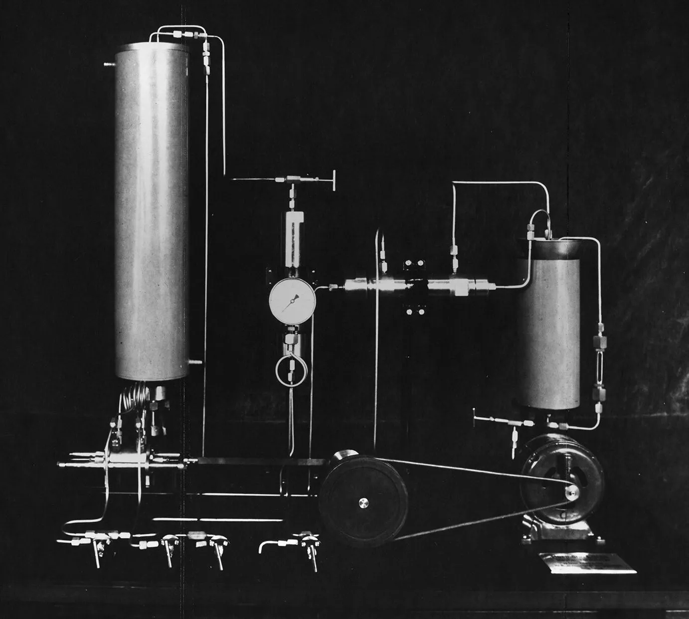
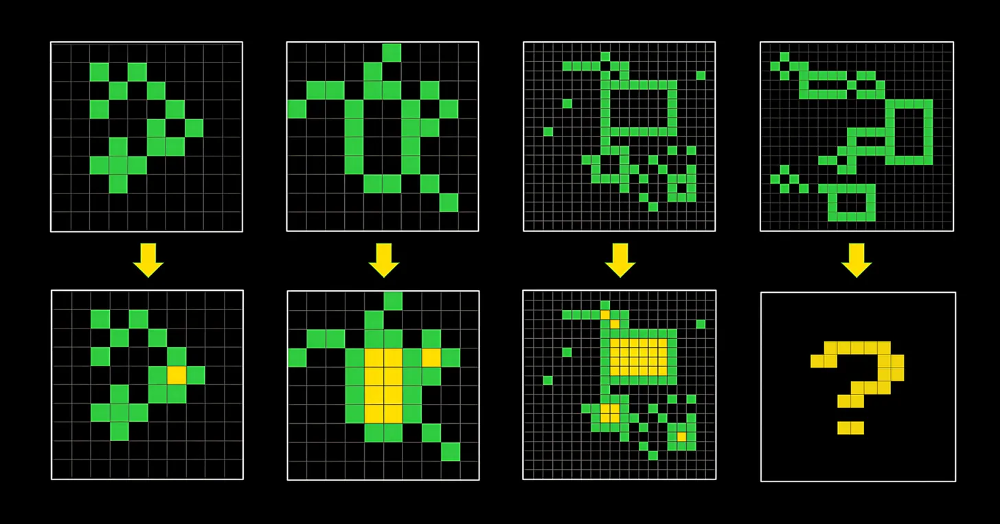
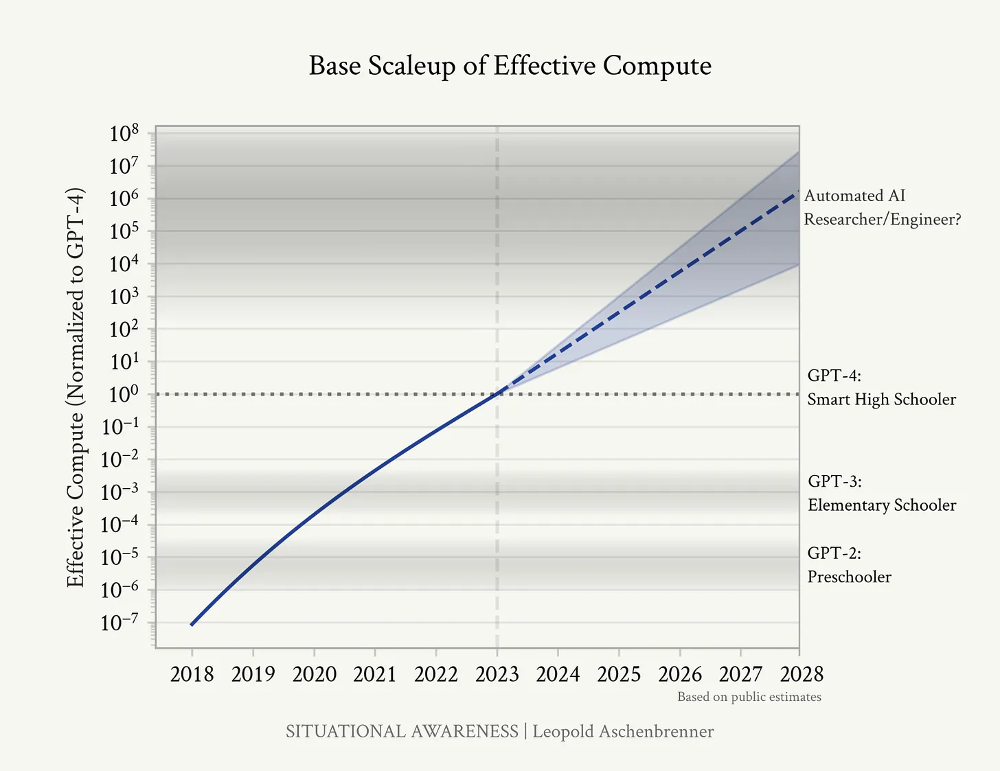

Title: It's hard to be a good techno-optimist
Author: Will Owens
Date: 2024-07-02
Slug: techno-optimist-hype
Summary: The pitfalls of techno-optimism and the subtle distinction between hype and hope.
Tags: essay, technology

---
_This essay was originally posted [on Substack](https://ovvens.substack.com/p/its-hard-to-be-a-good-techno-optimist#footnote-anchor-7-146088632)._

---

The year is 1905. Fritz Haber’s apparatus ekes out a pitiful dribble of ammonia. It’s more than he’s seen before, more than anyone had ever seen before. But it would never be enough. Not enough to answer the dire warning issued to the chemists at the dawn of the 20th century: find a way to make fertilizer from atmospheric nitrogen, or millions will starve.

<figure>

<caption>Haber’s Apparatus. (Fig. 12.1 from <a href="https://doi.org/10.1007/978-3-030-85532-1_12">Making Ammonia (2022) by Benjamin Johnson</a>, taken in turn from the Archive of the Max Planck Society)</caption>
</figure>

Other, more esteemed chemists before Haber had tried and failed to devise an industrially viable process to extract usable nitrogen from the air. Today, you might say that such a feat is guaranteed by Le Chatelier’s principle, and yet [Le Chatelier himself had tried and failed to synthesize ammonia in this fashion](https://web.archive.org/web/20240525150839/https://edu.rsc.org/feature/who-really-discovered-the-haber-process/2020277.article). The chemists of Haber’s day had no guarantees.

It would take four more years of toil from the tormented mind of Haber to make his apparatus into something “industrializable”. Bigger air compressors, more exotic catalysts, and no doubt a hundred other minor tweaks. Finally, his esoteric apparatus produced a trickle of ammonia that could—maybe—answer the clarion call to save the world from famine.

But this trickle alone would not be enough to feed starving millions. It took tens of thousands of experiments to find a cheaper catalyst. It took titanic pipes and bespoke fittings that pushed the limits of what the steelmaking industry was capable of in their day. It took massive ovens that could torture ammonia out of the air with unimaginable pressure and heat. It took the mettle of an upstart chemical engineer, Carl Bosch, a man who matched his academic counterpart Haber in tenacity, brilliance, and the complicated legacy he would leave behind.

<figure>

<caption>1935: Components of a high-pressure reactor being installed at Ludwigshafen, where the first industrial quantities of ammonia were produced. (From <em>BASF History: We create chemistry (2015)</em> by BASF)
</caption>
</figure>

Before Bosch and Haber, battles were fought for nitrogen. After Bosch and Haber, battles were fought for nitrogen factories.[ref]The first section of this essay is inspired by and greatly indebted to _The Alchemy of Air_ (2008) by Thomas Hager, which I highly recommend.[/ref] These are the stakes of a history-altering technological breakthrough.

In the decades to follow, the promise of the Haber-Bosch process was slowly realized in full. Having enjoyed steady (largely linear) growth since the 1960s, ammonia production now accounts for [approximately one percent of the world’s energy consumption](https://doi.org/10.1016/j.joule.2019.10.006). It’s estimated that [half of the world’s population today would die without this fertilizer](https://web.archive.org/web/20240621212849/https://ourworldindata.org/how-many-people-does-synthetic-fertilizer-feed).

---

The year is 2024. You can’t ride the subway or scroll through X (formally Twitter) without the two letters “AI” buzzing in your ear. AI evangelists tell you that [GPT-5 will be as smart as a PhD researcher](https://web.archive.org/web/20240622023259/https://www.digitaltrends.com/computing/openai-says-gpt-5-will-be-phd-level/).[ref]And, [in the words of Daniel Litt](https://x.com/littmath/status/1805782171543568893), “gpt-6 will have the intelligence of someone who decided not to get a PhD”.[/ref] Soon will be the day, we’re told, [when AI will solve all of physics](https://x.com/tsarnick/status/1806071104148271434).

I have no doubt that GPT-5 and its successors will do an excellent job of _predicting the next words_ that a PhD researcher _might_ say. For my money, GPT-4 and GPT-3.5 already do an impressive job at _predicting the next word_, and it’s striking how far this algorithm can take you. Genuine credit is due to the hardworking statisticians, hardware designers, and programmers who have scaled _predicting the next word_ to unimaginable heights.

And yet, [ask this algorithm to solve an elementary school puzzle about shapes and colors](https://web.archive.org/web/20240611174821/https://arcprize.org/blog/launch), and watch it crumble.[ref]Also relevant here is the paper,  <a href="https://doi.org/10.1007/978-3-030-85532-1_12">On the Measure of Intelligence (2019)</a> by François Chollet, co-creator of the ARC prize referenced above. While this paper was written before the release of GPT-3 and subsequent ratcheting of the AI fever into high gear, I feel it is more relevant now than ever and remains the most damning critique of current AI hype.  For what it’s worth, I have faith that the ARC prize will be claimed one day, maybe even soon, just not by a monolithic LLM. I predict that the ARC challenge (and general intelligence itself) will mean resurrecting the automated reasoning systems of the pre-1980s AI winter to work in tandem with the LLMs of our day. Of course, this proposition is hardly original ([see the ideas of Marvin Minsky](https://en.wikipedia.org/wiki/Society_of_Mind)).[/ref] Useful code generation tool, certainly. Drop-in replacement for a human being, certainly not. The difference between seeming and being, it seems, is lost on many AI evangelists.

<figure>

<caption>Existing AI models lack the abstract reasoning to reliably solve tasks like this one without training on many examples beforehand. (From <a href="https://arcprize.org/arc">François Chollet, co-creator of the ARC Prize and ARC-AGI Benchmark</a>.)
</caption>
</figure>

Why are so many people so confident in impending AI superintelligence? There is plenty of money to be made in stoking excitement—or fear—about AI progress. For some, especially those who’ve read too much science fiction or written too much Harry Potter fanfic, this belief has morphed into an entire eschatology, where Frankenstein’s monster is a rack of Nvidia H100 GPUs trying to turn you into paper clips[ref]For those unfamiliar, this is a reference to [Nick Bostrom’s paperclip maximizer thought experiment](https://en.wikipedia.org/wiki/Instrumental_convergence#Paperclip_maximizer), which has become something of a meme in rationalist and futurist circles. For a more dramatic treatment of the subject, see Gwern’s [“It Looks Like You’re Trying To Take Over The World](https://gwern.net/fiction/clippy)”.[/ref].

Let’s set aside Frankenstein’s GPUs for now. On what basis does one actually believe that _predicting the next word_ can be scaled to AI superintelligence? Last month, AI alignment scholar Leopold Aschenbrenner published a manifesto titled _[Situational Awareness: The Decade Ahead](https://web.archive.org/web/20240604155230/https://situational-awareness.ai/)._ General artificial intelligence by 2027, he argued, “just requires believing in straight lines on a graph.”[ref]In fairness to Aschenbrenner, he backs this claim up with a lot of historical background and figures about progress in AI. It still, fundamentally, rests on a flawed definition of “intelligence” (see _On the Measure of Intelligence_ above) and spurious extrapolation of an exponential curve.[/ref].

<figure>

<caption>The “straight lines on a graph” that Aschenbrenner requires you to believe in. (from <a href="https://situational-awareness.ai/from-gpt-4-to-agi/"><em>Situational Awareness</em></a>).
</caption>
</figure>

Of course, a cursory look at the logarithmic y-axis will reveal that these “straight lines” are really exponential curves in disguise. And thus, as many were quick to point out. Aschenbrenner is not only guilty of extrapolating[ref]See also: [relevant xkcd #605](https://xkcd.com/605/).[/ref], but extrapolating from an exponential curve.

n nature, most, if not all, exponential curves turn out to be logistic curves. Rabbits multiply exponentially in a field … until you run out of field. Bacteria divide exponentially in a tube… until you run out of broth.

There is no guarantee that AI researchers can maintain this scaleup. There isn’t even a guarantee that this scaleup will actually translate into something worthy of the title “general intelligence”. Even if we grant that such a model is attainable, AI researchers could easily outpace the semiconductor fabs needed to build it, exhaust the electric grid needed to power it, run out of ebooks and Reddit comments to feed it, or hit some other unanticipated limit needed to churn through higher and higher dimensional matrices.

Aschenbrenner is hardly the first overzealous futurist to run afoul of the “exponential growth fallacy”. He is joined by legions of people who have faith in the graph above. The question then becomes, why are so many people today comfortable with assuming exponential growth?

In Aschenbrenner’s own words (**emphasis mine**):

> We have machines now that we can basically talk to like humans. It’s a remarkable testament to the human capacity to adjust that this seems normal, **that we’ve become inured to the pace of progress.**

As weird as it is that I can have a semi-believable conversation with an iPhone app, it’s even weirder that we’ve spent the better part of four generations in exponential technological growth disproportionately driven by one field: computing. Moore’s Law—the famous observation that computing power tends to increase exponentially over time—has become a common refrain and point of reference for technologists.

People today are so “inured to the pace of progress” that they assume exponential growth is the norm. The consequences of Moore’s Law have become such a fixture in our lives that we have come to expect guaranteed returns from all kinds of technology. And like the AI evangelists I criticize here, I too am guilty of this.

---

The year is 2018. I am an undergraduate student attending the keynote talks for that year’s International Genetically Engineered Machines competition (iGEM). On stage is Jason Kelly—CEO and co-founder of Ginkgo Bioworks—touting an “I ❤️ GMO” pin, images of his company’s fully-automated genetic engineering foundries, and the vision of a world where we could program biology like computers[ref]I’m not aware of any recordings or notes from Kelly’s 2018 keynote, but that talk was similar to one he gave in [2017 for the Library of Congress symposium “Life As It Could Be: Astrobiology, Synthetic Biology, and the Future of Life”](https://www.youtube.com/watch?v=RsCoctpBe14&t=8223s).[/ref]. Based on that vision, his startup Ginkgo had recently [raised another $275 million, making it worth over $1 billion](https://web.archive.org/web/20171215102508/https://techcrunch.com/2017/12/14/gingko-bioworks-secures-275-million-in-series-d-valuing-the-company-at-over-1-billion/).

<figure>

<caption>My view of the main stage at iGEM 2018.
</caption>
</figure>

In 2006, a group of A-list bioengineers wrote “[Engineering life: building a fab for biology](https://doi.org/10.1038/scientificamerican0606-44)”. Like their distant cousins in the AI world, the authors of this article invoked Moore’s Law and likened their nascent field of synthetic biology to that of computer engineering in the 1950s. They outlined the recent advances in reading and writing DNA molecules and how they could…

> …constitute the basis of a bio fab, and much like semiconductor chip lithography, these processes can be expected to keep steadily improving over time. That frees us to think about what we will build in the fab.

The “Bio FAB Group” included Drew Endy, who had initiated “a library of biological components similar to the libraries available to chip designers” together with Tom Knight and Randy Rettberg, two veterans of electrical engineering turned bioengineering pioneers[ref]At the time of the Bio FAB publication, Endy was an MIT Biological Engineering professor advising a PhD student Jason Kelly. In 2008, Kelly would be joined by Knight in founding Ginkgo Bioworks. Rettberg co-created and now leads the iGEM Foundation, responsible for the very competition I was participating in back in 2018.  To fully appreciate this connection between synthetic biology and the field of computing, it’s worth reading about [Knight’s extensive accomplishments in computing](https://en.wikipedia.org/wiki/Tom_Knight_\(scientist\)#Work_in_electrical_engineering_and_computer_science) before his pivot to bioengineering. For his own part, Rettberg [served as Chief Technology Officer at the legendary Sun Microsystems](https://web.archive.org/web/20240228140044/https://blog.igem.org/blog/2019/9/18/what-is-igem-part-3) before joining Knight. Finally, iGEM evolved from a class taught by Endy, Knight, and Rettberg alongside [Gerry Sussman](https://web.archive.org/web/20231207012333/https://www.csail.mit.edu/person/gerald-sussman), a preeminent artificial intelligence researcher, LISP programmer, and celebrated MIT professor of computer science.[/ref]. From its earliest days, synthetic biology was shaped both by people inspired by computer engineering and computer engineers themselves, all driven by a vision to program biology like computers.

I was completely sold. As a microbiology and computer science sophomore, especially one more comfortable with the keyboard than the pipette, the idea of “programmable biology” was particularly seductive. If evolution has created the most complex machines of the Universe, then synthetic biology promised to give us the tools to finally control them. Hearing Jason Kelly’s talk had cemented my dream to become a synthetic biologist.

I saw my dream fulfilled in my first job at Octant, in a position that actually had “synthetic biology” in the title. I worked in an office with respectable ex-Ginkgo and Ginkgo-adjacent scientists and saw my knowledge of the burgeoning field and my confidence with the pipette soar.

And yet, sitting at the lab bench instead of an auditorium, synthetic biology felt less like programming and more like 1980s restriction cloning, but with more DNA sequencing and synthesis. A good mentor at Octant once said to me, “a lot of people with your interests think that biology is like programming, but it’s not. The most trivial things will go wrong one day, and work fine the next.”

Make no mistake, the researcher of the 2020s can make a desired DNA construct much more readily than one in the 1980s. But this is a difference of degree. I still felt like Carl Bosch’s employees, trying tens of thousands of different catalysts to find the one that, for whatever reason, actually works. Despite this reality, across companies and academic labs alike, I saw the phrase “synthetic biology” slapped on so many things, just like the phrase “artificial intelligence” is today.

Meanwhile in 2021, shortly after I joined Octant, Ginkgo Bioworks went public at $10 per share. On the day of the initial public offering (IPO), they decorated the facade of the New York Stock Exchange [with evocative images of colorful flowers, dinosaurs, and DNA molecules](https://x.com/Ginkgo/status/1438850166472257544). On towering billboards in Times Square, Ginkgo asked, “[what if we could grow everything?](https://vimeo.com/540714983)”

At a valuation of $15 billion, for me, Ginkgo was living proof of synthetic biology’s value and potential to change the world. [In a September 2021 press release](https://web.archive.org/web/20210922133317/https://investors.ginkgobioworks.com/news/news-details/2021/Ginkgo-Bioworks-to-Begin-Trading-Today-as-NYSE-DNA-with-Over-1.6-Billion-in-Proceeds/default.aspx), Kelly reiterated the company’s mission to make biology programmable **(emphasis mine**):

> "For nearly two decades, my co-founders and I have been on **a mission to make programming cells as easy as programming computers**," said Jason Kelly, CEO and co-founder at Ginkgo. "Today marks an important milestone not only for the team at Ginkgo, **but for synthetic biology as a whole**, and I am thrilled to work with our team, partners and investors as we continue scaling our platform to solve even bigger problems with biology."

Ginkgo and its IPO, however, were not without their detractors. [Writing for the MIT Technology Review, Antonio Regalado](https://web.archive.org/web/20210824105424/https://www.technologyreview.com/2021/08/24/1032308/is-ginkgos-synthetic-biology-story-worth-15-billion/) captured much of the criticism aimed towards the company that he called “the face of synthetic biology”. Despite its lofty proclamation to “grow everything”, like many synthetic biology companies before it, Ginkgo’s main products were niche[ref]In the article, Regalado quotes George Church, another member of “The Bio FAB Group” and coincidentally another speaker at iGEM 2018. Though a supporter of Ginkgo, Church opined, “I think flavors and fragrances is very far from the vision that biology can make anything.”[/ref]. Much of the company’s sales were to partially owned subsidiaries. Its partnerships with companies like Synlogic[ref]In 2024, Synlogic [would later face grave difficulties of its own](https://web.archive.org/web/20240229083144/https://www.fiercebiotech.com/biotech/end-line-synlogic-biotech-lays-90-over-pku-drugs-phase-3-fail) after its genetically engineered gut probiotic performed poorly in clinical trials.[/ref] had borne questionable fruit. The title of the article posed a frank question: “[is Ginkgo’s synthetic biology story worth $15 billion?](https://web.archive.org/web/20210824105424/https://www.technologyreview.com/2021/08/24/1032308/is-ginkgos-synthetic-biology-story-worth-15-billion/)”

In 2024, the market’s invisible hand has answered this question in the negative. As of writing, Ginkgo Bioworks stock is trading at around $0.33 per share, giving it a market cap of around $700 million—a far cry from its earlier valuation of $15 billion. Last week, [the company laid off over a third of its employees](https://web.archive.org/web/20240628231830/https://www.fiercebiotech.com/medtech/ginkgo-bioworks-lay-many-400-employees).

Ginkgo’s situation is not unique, [as hundreds of layoffs have rocked the biotech sector in the past two years](https://web.archive.org/web/20240628193700/https://www.fiercebiotech.com/biotech/fierce-biotech-layoff-tracker-2024). Many companies before Ginkgo have struggled or outright failed to make killer products with synthetic biology. Nobody ever said that engineering biology would be easy. And now, in the third decade of synthetic biology, engineering biology remains anything but easy.

If anything, the disconnect between my perception and the reality of synthetic biology is mostly owed to naïveté on my part. Still, after consuming years of synthetic biology evangelism, it’s hard to decouple my belief in an impending “synthetic biology revolution” from the performance of one of its greatest advocates.

Now, as a PhD student at MIT, I work on a lot of things that you could probably slap the label of “synthetic biology” on. But I find myself hesitant to use those words. The “synthetic biology revolution” I had dreamed of feels much more distant now and anything but guaranteed.

---

Looking at these three attempts at technological disruption should remind us that computing is the outlier in technology development. In the days before the computer revolution, innovators like Haber and Bosch could not fall back on any technical projections or promises of feasibility. They could only hope that what they wanted was actually possible, and then roll up their sleeves and make it possible. In the time since Haber first flipped on his apparatus, the improvements to his namesake process have all been hard-fought and incremental.

Now, thanks to the heroic work of four generations of computer engineers, you can instead enjoy a guarantee of exponential progress—as long as you can make number crunching the bottleneck of your particular problem. Perhaps this is why so many people in the artificial intelligence world are hoping for the day when _every problem_ is a problem for computers. “Computer, please solve all of physics for me.”

Unfortunately, most aspects of physical reality cannot be pegged to the improvement of computers. Computers can be a great help. But the heavy lifting, for now, will still be done by human hands and minds.

While the men of Haber and Bosch’s day were no strangers to progress, we’re drowning in it. We’re forever bobbing in the waves of the computer revolution, so much so that we’ve lost the common intuition shared by the pre-industrial man. Progress is not guaranteed. You cannot point to a place on a graph where you would like to be, sit back, and let your technological projections carry you there.

Like the AI evangelists I have criticized, I too was eager to hang my hopes on an exponential curve carrying me to success. I eventually realized that, much like “artificial intelligence”, “synthetic biology” is a marketing buzzword. These buzzwords are useful. They help convince busy, important people that what you’re working on is also important. But a competent technologist must see these stories for what they are: not a promise, not a guarantee, just a dream of a better world.

Maybe this is a rite of passage that everyone goes through: realizing that everything is kinda bullshit. As pessimists on Twitter like to say, “nothing ever happens.” And yet, despite my sobering experiences with synthetic biology and disillusionment with AI hype, I still believe that radical, earth-shaking change—like that of Haber and Bosch’s day—is possible in our time.

You cannot surf the waves of an exponential curve to change the world. Birthing a truly important breakthrough means swimming against the currents of your day. It means kicking and fighting in dark waters. We can only swim, blindly, towards what we hope will succeed.

---

_Thank you to my friends that read and offered comments on this—you know who you are._

---